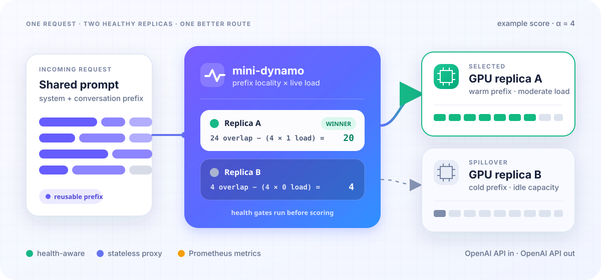

<div align="center">

<h1>mini-dynamo</h1>
<h3>Reuse the prefix. Balance the load.</h3>
<p>A compact Rust router that puts each OpenAI-compatible inference request on<br>the healthy GPU replica where it can do the least repeated work.</p>
<p>
  <a href="https://github.com/helixml/mini-dynamo/releases"></a>
  <a href="LICENSE"></a>
  <a href="rust-toolchain.toml"></a>
</p>

</div>

<p align="center">
  
</p>

mini-dynamo sits between your clients and replicated model servers. It keeps
conversations and shared system prompts near warm cache state, then lets live
load override affinity before one replica becomes a hotspot. Clients keep the
same OpenAI API; engines need no mini-dynamo-specific integration.

## Why it exists

| Reuse more | Queue less | Fail cleanly |
| --- | --- | --- |
| Bounded prefix fingerprints find the replica most likely to reuse prior work. | Size-weighted reservations spread cold prefills and concurrent decodes. | Active health probes, retryable failover, and immediate disconnect cancellation keep capacity honest. |

The ordinary router is stateless, privacy-bounded, and deliberately useful
without raw KV-cache events. Optional DSpark enforcement persists only opaque
quarantine commitments so an LB restart cannot forget a bad EngineCore. The
production path remains the proxy plus your existing OpenAI-compatible engines.

## Measured on real hardware

Reference stack: DeepSeek-V4-Flash-0731, two TP4 replicas, 8× RTX PRO 6000.

| Result | Measured outcome |
| --- | ---: |
| Shared-app concurrency, load-blind → mini-dynamo | **298 → 469 output tok/s · 1.57×** |
| Fresh 3-app × 4-session locality run | **82.5% cached prompt tokens** |
| Whole-box deterministic code, c24/max256 | **1,820–1,844 output tok/s** |

These are workload results, not theoretical peaks. Reproduce them from
[RESULTS.md](RESULTS.md); inspect every accepted and rejected experiment in
[EXPERIMENTS.md](EXPERIMENTS.md).

## Start in one minute

For existing engines, the upstream list is normally the only setting you need:

```yaml
services:
  mini-dynamo:
    image: ghcr.io/helixml/mini-dynamo:v0.1.0@sha256:62d949e0e6b3880796fab6c12f148f24d3f76449cb8397da6e81fe6e57dd70a1
    restart: unless-stopped
    ports:
      - "8000:8000" # OpenAI API + /health
      - "9090:9090" # Prometheus
    environment:
      MD_UPSTREAM: http://model-server-1:8000,http://model-server-2:8000
      # MD_UPSTREAM_TOKEN: ${MODEL_SERVER_API_KEY} # if required
```

```bash
docker compose up -d
curl --fail http://localhost:8000/health
```

Version 0.1.0 is the first public Rust release. The example pins it by immutable
digest.
Safe defaults enable locality/load routing and keep tokenizer, raw KV-event,
exact-placement, and snapshot paths off. See the complete
[configuration table](docs/configuration.md), or start from the validated
[two-replica Compose stack](deploy/dspark_0731/docker-compose.yaml).

> **Backend compatibility:** `model-server-1` and `model-server-2` are example
> Docker DNS names—replace them with your backends. The default router is not
> tied to vLLM: it forwards OpenAI-compatible APIs and health-checks each server
> with `GET /v1/models`. The opt-in `/tokenize`, KV-event, exact-routing, and
> snapshot research paths are currently designed for vLLM/DSpark.

## The routing rule

```text
score(replica) = min(prefix overlap, affinity cap) − α × live load
```

mini-dynamo fingerprints only a bounded prefix, scores every healthy replica,
and reserves load before forwarding. Warm state wins when it is valuable; idle
capacity wins when reuse no longer pays for the queue. Score ties prefer the
deeper raw overlap.

## Production surface

- OpenAI-compatible chat/completions, streaming, reasoning, and tool calls.
- `ok`, `degraded`, and `unhealthy` readiness at `GET /health`.
- Optional SHA-pinned model/template compatibility admission for engines that
  expose the atomic identity contract, with fail-closed per-replica recovery;
  the node06 guide includes an opt-in, no-extra-hop vLLM middleware candidate.
- Optional DSpark reliability observation and sticky per-replica quarantine
  when active K5 acceptance collapses to zero across multiple complete metric
  windows; enforcement fsyncs an opaque EngineCore commitment and only a
  different compatibility-attested EngineCore can durably rearm it. A
  precommitted dirty marker keeps unresolved replicas fenced after an unclean
  LB exit or failed state mutation.
- Stable `ds4proxy_*` Prometheus metrics on port `9090`.
- Opaque `X-Mini-Dynamo-Upstream` route correlation without leaking hosts.
- Bounded memory, request sanitization, model metadata rewriting, and upstream
  cancellation when the client disappears.

Exact tokenization, fenced KV indexes, authenticated snapshot companions,
exact-placement canaries, and session-affinity shadow telemetry remain opt-in
research surfaces. The session path cannot change placement. These paths fail
closed and are not dependencies of ordinary serving.

## Operate it

| Task | Start here |
| --- | --- |
| Deploy or roll back | [Docker Compose operator guide](deploy/dspark_0731/README.md) |
| Configure the router | [Environment reference](docs/configuration.md) |
| Understand the design | [Architecture and routing model](DESIGN.md) |
| Inspect current work | [Roadmap](ROADMAP.md) |

Codex-compatible repo skills are included for repeatable node operations:
[`$deploy-mini-dynamo`](.agents/skills/deploy-mini-dynamo/SKILL.md),
[`$optimize-mini-dynamo-node`](.agents/skills/optimize-mini-dynamo-node/SKILL.md),
[`$load-test-mini-dynamo-node`](.agents/skills/load-test-mini-dynamo-node/SKILL.md),
and
[`$troubleshoot-mini-dynamo-node`](.agents/skills/troubleshoot-mini-dynamo-node/SKILL.md).

## Develop

```bash
cargo fmt --check
cargo test --locked
cargo clippy --locked --all-targets --all-features -- -D warnings
```

<details>
<summary>Privacy-safe production-shape replay</summary>

For privacy-safe production-shape validation, `bench/agent_trace.py` accepts
only numeric/enumerated trace shapes and synthesizes all request content. A
bounded `/tokenize` preflight adjusts for the active chat-template overhead;
authoritative response usage still enforces the token-density gate. See the
[sovereign trace replay contract](bench/agent_cases/README.md#sovereign-trace-shape-replay).

</details>

See [AGENTS.md](AGENTS.md) for the GPU-free inner loop, full release gate, and
node06 benchmark contract. Apache-2.0 licensed.
