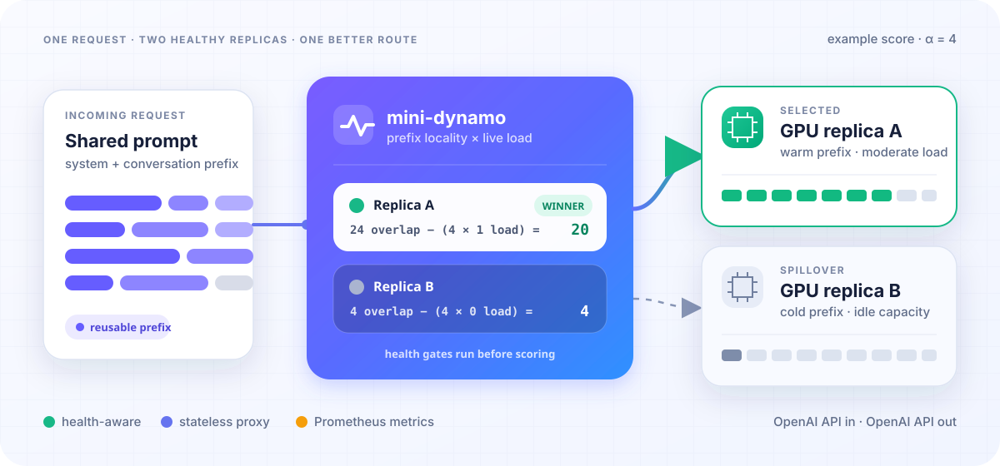

<div align="center">

<h1>ramjet</h1>
<h3>Warm intake. Balanced burn.</h3>
<p>A compact Rust router that puts each OpenAI-compatible inference request on<br>the healthy GPU replica where it can do the least repeated work.</p>
<p>
  <!-- The release and license badges were API-backed and rendered "repo not
       found" because this repository is private: shields.io queries the GitHub
       API anonymously. The release and LICENSE themselves are fine. If the
       repository is ever made public, they can be restored as:
         https://img.shields.io/github/v/release/helixml/ramjet
         https://img.shields.io/github/license/helixml/ramjet -->
  <a href="rust-toolchain.toml"></a>
</p>

</div>

<p align="center">
  
</p>

ramjet sits between your clients and replicated model servers. It keeps
conversations and shared system prompts near warm cache state, then lets live
load override affinity before one replica becomes a hotspot. Clients keep the
same OpenAI API; engines need no ramjet-specific integration.

## What we wrote about each model

How ramjet and the engines behind it were tuned for each model, written up
on the Helix blog. GLM-5.3 ran on an 8× H200 server; the others on our
8× RTX PRO 6000 server:

| GLM-5.3 (8× H200) | GLM-5.3-Flash | Qwen3.8-Flash-Next | Qwen3.8-27B | DeepSeek V4 |
| --- | --- | --- | --- | --- |
| [48 coding agents from one server](https://helix.ml/blog/glm53-on-8x-h200) (29 Sep) | [Part 1: getting day-zero serving to work](https://helix.ml/blog/glm53-flash-on-rtx-pro-6000-part-1) (27 Aug) | [On eight GPUs: what actually helped](https://helix.ml/blog/qwen38-flash-next-on-rtx-pro-6000) (27 Aug) | [Chasing a 454 tok/s tweet](https://helix.ml/blog/chasing-454-toks-qwen38-rtx-pro-6000) (22 Aug) | [SGLang vs DwarfStar vs vLLM+DSpark](https://helix.ml/blog/running-ds4-on-rtx-pro-6000) (14 Aug) |
| [Ramjet vs NVIDIA Dynamo](https://helix.ml/blog/ramjet-vs-nvidia-dynamo) (30 Sep) | [Running on 2, 4 or 8 GPUs](https://helix.ml/blog/glm53-flash-tp2-rtx-pro-6000) (14 Sep) | [One model, two speeds: smart routing](https://helix.ml/blog/smarter-qwen-routing-with-ramjet) (28 Aug) | [Doubling throughput by reading a log line](https://helix.ml/blog/the-ceiling-was-a-state-cache) (23 Aug) | [V4.1 Flash: encoder, Engram and KV cache](https://helix.ml/blog/deepseek-v41-flash-explained) (10 Sep) |
| | [Ran out of cache snapshots, not cache tokens](https://helix.ml/blog/glm53-flash-hybrid-attention-prefix-cache) (26 Sep) | [Swift 1.5 cut thinking tokens](https://helix.ml/blog/swift-flash-next-four-gpu-evaluation) (27 Sep) | [A better lm_head, tested and shipped](https://helix.ml/blog/qwen38-bf16-lm-head-rollout) (25 Aug) | |

## Why it exists

| Reuse more | Queue less | Fail cleanly |
| --- | --- | --- |
| Bounded prefix fingerprints find the replica most likely to reuse prior work. | Size-weighted reservations spread cold prefills and concurrent decodes. | Active health probes, retryable failover, and immediate disconnect cancellation keep capacity honest. |

The ordinary router is stateless, privacy-bounded, and deliberately useful
without raw KV-cache events. Optional DSpark enforcement persists only opaque
quarantine commitments so an LB restart cannot forget a bad EngineCore. The
production path remains the proxy plus your existing OpenAI-compatible engines.

## Built-in dashboard

System overview to see how your node is doing:


And specific serving tab:


You can also just plug it into prometheus, `/metrics` API is available. 

## Measured on real hardware

| Model · server | What changed | Before → after | Change |
| :-- | :-- | --: | --: |
| <sub>**DeepSeek-V4-Flash**<br>2× TP4 · 8× RTX PRO 6000</sub> | <sub>12 same-app sessions, load-blind router → ramjet</sub> | <sub>298 → **469** output tok/s</sub> | <sub>$`\color{#2DA44E}\blacktriangle\;\textsf{57%}`$</sub> |
|  | <sub>Fresh 3-app × 4-session locality run</sub> | <sub>**82.5%** cached prompt tokens</sub> |  |
|  | <sub>Whole-box deterministic code, c24/max256</sub> | <sub>**1,820–1,844** output tok/s</sub> |  |
| <sub>**Qwen3.8-Flash-Next**<br>2× TP4 · 8× RTX PRO 6000</sub> | <sub>Request queued behind a long one, phase-aware load release</sub> | <sub>TTFT 2,496 → **287** ms</sub> | <sub>$`\color{#2DA44E}\blacktriangledown\;\textsf{88.5%}`$</sub> |
|  | <sub>Same runs, the long request's own output</sub> | <sub>100% → **99.1%** tok/s</sub> | <sub>$`\color{#E5534B}\blacktriangledown\;\textsf{0.9%}`$</sub> |
|  | <sub>Direct vLLM → same engine through ramjet</sub> | <sub>c1 −0.03% · c16 −0.24% tok/s</sub> | <sub>$`\color{#8B949E}\blacktriangledown\;\textsf{≈ 0}`$</sub> |
| <sub>**GLM-5.3-Flash**<br>2× TP4 · 8× H200</sub> | <sub>Coding-agent swarm, prefix routing → `marginal` affinity</sub> | <sub>197 / 194 → **243 / 249** turns/min</sub> | <sub>$`\color{#2DA44E}\blacktriangle\;\textsf{23–28%}`$</sub> |
|  | <sub>Same runs, TTFT p90</sub> | <sub>5.3–5.5 → **3.2–3.3** s</sub> | <sub>$`\color{#2DA44E}\blacktriangledown\;\textsf{38–42%}`$</sub> |
| <sub>**GLM-5.3**<br>DP8 attention · 8× H200</sub> | <sub>32 / 48 coding agents, NVIDIA Dynamo 1.5.0 → ramjet, same engine</sub> | <sub>73.0 / 77.3 → **88.9 / 99.5** turns/min</sub> | <sub>$`\color{#2DA44E}\blacktriangle\;\textsf{22% / 29%}`$</sub> |
|  | <sub>Same runs, cached prompt tokens</sub> | <sub>85% → **92%**</sub> | <sub>$`\color{#2DA44E}\blacktriangle\;\textsf{7 pts}`$</sub> |

These are workload results, not theoretical peaks. Reproduce the DeepSeek rows
from [RESULTS.md](RESULTS.md); inspect every accepted and rejected experiment in
[EXPERIMENTS.md](EXPERIMENTS.md).

### Models with a validated stack

All measured on node06 — 8× RTX PRO 6000 Blackwell; the engine topology is
listed per row. The full-box column reports the best qualified saturation
point recorded for that stack, not a shared concurrency level. Green
triangles mark a measured improvement, red a measured cost, and grey a change
within noise.

| Model · served as | Engine · measured shape | Decode @ c1 | Full-box peak | Compose |
| :-- | :-- | --: | --: | :-- |
| <sub>**DeepSeek-V4-Flash**<br>sparse MoE · `deepseek-v4-flash`</sub> | <sub>vLLM + DSpark<br>2× TP4 · c24/max256</sub> | <sub>**245.1** tok/s</sub> | <sub>**1,891.2** tok/s</sub> | <sub>[`dspark_0731`](deploy/dspark_0731/docker-compose.yaml)</sub> |
| <sub>**Qwen3.8-27B FP8**<br>dense · `qwen3.8-27b`</sub> | <sub>vLLM<br>2× TP4 · c256/max256 · MTP off</sub> | <sub>77 → **121** tok/s<br>$`\color{#2DA44E}\blacktriangle\;\textsf{57% with MTP}`$</sub> | <sub>**7,890.9** tok/s</sub> | <sub>[`qwen38_27b`](deploy/qwen38_27b/docker-compose.yaml)</sub> |
| <sub>**Qwen3.8-27B NVFP4 + BF16 head**<br>dense · `qwen3.8-27b`</sub> | <sub>SGLang + DFlash2<br>8× TP1 · 208 slots · bf16 SSM</sub> | <sub>**153.3** tok/s greedy median<br>$`\color{#2DA44E}\blacktriangle\;\textsf{7.5% vs Inferact}`$</sub> | <sub>not yet requalified<br>Inferact target: 7,882.6 tok/s</sub> | <sub>[`qwen38_27b`](deploy/qwen38_27b/docker-compose.yaml)</sub> |
| <sub>**Qwen3.8-Flash-Next FP8**<br>sparse MoE · `qwen3.8-flash-next`</sub> | <sub>vLLM<br>2× TP4+EP · c64 · MTP3 on both</sub> | <sub>113 → **202** tok/s<br>$`\color{#2DA44E}\blacktriangle\;\textsf{79% with MTP3}`$</sub> | <sub>**3,340.5** tok/s</sub> | <sub>[`qwen38_flash_next`](deploy/qwen38_flash_next/docker-compose.yaml)</sub> |
| <sub>**GLM-5.3-Flash W4A16, FP8 experts**<br>sparse MoE · `glm-5.3-flash`</sub> | <sub>SGLang + EAGLE<br>TP2 · c4/max256</sub> | <sub>**164.8** tok/s</sub> | <sub>**388.2** tok/s per 2-GPU replica<br>whole box not yet saturated</sub> | <sub>[`glm53_flash_sm120`](deploy/glm53_flash_sm120/docker-compose.yaml)</sub> |

No model — and neither Qwen3.8-27B stack — is simply better. Single-stream
decode is what an interactive user feels; the full-box figure is a capacity
landmark for a saturated agent fleet. These maxima come from separate
model-specific workloads, so they are not a matched head-to-head benchmark.
The vLLM row's saturation result has MTP off because speculation improves
low-concurrency latency but wastes rejected drafts once the batch saturates
the GPU. The SGLang row uses RadixArk's immutable
BF16-`lm_head` checkpoint. Its matched one-engine canary measured 153.3 tok/s
against 142.6 for the former Inferact target (+7.5%), with the same 7/8
objective answers and 20/25 deterministic agent-protocol cases. The smaller
target exposes 26 running slots and 582,246 KV tokens per engine: 208 slots
across the fleet. Full-box saturation has not yet been requalified on these
weights; the former Inferact target reached 7,882.6 tok/s, within 0.1% of the
vLLM reference. On that earlier SGLang stack, bf16 SSM state reduced c128 TTFT
p95 from 3.99s to 0.221s. The same
3-app × 4-session × 2-turn locality run measured **87.3% cached prompt
tokens**, and 12 concurrent same-app requests spread across 7 of 8 engines
at 714 tok/s. Its cost is cold long-context prefill: a 196K-token first
turn pays ~57s of TTFT on one GPU, with prefix-cached follow-ups at 2–4s.

Qwen3.8-Flash-Next shows the same speculation trade-off: on 256-token outputs
MTP3 adds 79% at c1 but only 7.5% at c32. The qualified pair therefore runs
MTP3 on one engine and standard decoding on the other, and ramjet uses the
requested output length to pick between them only once cache and load tie. Its
full-box figure predates that split, with MTP3 on both engines. GLM-5.3-Flash
runs on two GPUs per replica; its prefix cache is bounded by saved
linear-attention states rather than KV tokens. Keeping two states per path
instead of four, plus a 4 GB host tier, took a probe of 12 cyclic 20k-token
sessions from 0/12 to 12/12 cached. The [Kev
stack](deploy/qwen38_glm53_kev/README.md) adds a 0.8B decision model to the
same server, sharing one Qwen GPU behind a second API profile: 77 ms p50 per
short three-question request at c1 and 20.3 requests/s at c4, measured beside
live traffic rather than saturated.
[Model profiles](docs/models.md) covers the sizing, sharding, and
speculative-decoding trade-offs behind these numbers.

### Full GLM-5.3 on one 8× H200 server

[`deploy/glm53_h200`](deploy/glm53_h200/README.md) runs the 753B FP8
checkpoint as one SGLang engine with eight data-parallel attention ranks, and
ramjet lists each rank as its own upstream (`RJ_UPSTREAM_DP_RANKS`). On a
simulated team of continuously working coding agents:

| Agents | What changed | Before → after | Change |
| :-- | :-- | --: | --: |
| <sub>16</sub> | <sub>SGLang rank placement → ramjet per-rank routing</sub> | <sub>43.0 → **72.7** turns/min<br>65.6% → **92.8%** cached</sub> | <sub>$`\color{#2DA44E}\blacktriangle\;\textsf{69%}`$</sub> |
| <sub>64</sub> | <sub>Same, plus a 32 GB host KV tier per rank</sub> | <sub>45.9 → **95.1** turns/min</sub> | <sub>$`\color{#2DA44E}\blacktriangle\;\textsf{107%}`$</sub> |
| <sub>32–48</sub> | <sub>Capacity per server</sub> | <sub>**98–109** turns/min<br>TTFT p50 1.3–2.8 s</sub> |  |

The [blog post](https://helix.ml/blog/glm53-on-8x-h200) walks through each
step, and [Ramjet vs NVIDIA Dynamo](https://helix.ml/blog/ramjet-vs-nvidia-dynamo)
compares the router against Dynamo 1.5.0's KV router on the same engine; the
raw cells are in [EXPERIMENTS.md](EXPERIMENTS.md) (2026-09-29 and 2026-09-30).

## Start in one minute

For existing engines, the upstream list is normally the only setting you need:

```yaml
services:
  ramjet:
    image: ghcr.io/helixml/ramjet:v0.7.0@sha256:dca028638314ca3171120532a075faaa70483e1494dd3d04bddc4db4eb88c01d
    restart: unless-stopped
    ports:
      - "8000:8000" # OpenAI API + /health
      - "9090:9090" # Prometheus
    environment:
      RJ_UPSTREAM: http://model-server-1:8000,http://model-server-2:8000
      # RJ_UPSTREAM_TOKEN: ${MODEL_SERVER_API_KEY} # if required
```

```bash
docker compose up -d
curl --fail http://localhost:8000/health
```

The example pins a released image by immutable digest; see
[`CHANGELOG.md`](CHANGELOG.md) for what each version contains.
Safe defaults enable locality/load routing and keep tokenizer, raw KV-event,
exact-placement, and snapshot paths off. See the complete
[configuration table](docs/configuration.md), or start from the
[eight-replica Compose stack](deploy/qwen38_27b/docker-compose.yaml) currently
running in production. The
[two-replica DeepSeek-V4-Flash stack](deploy/dspark_0731/docker-compose.yaml)
is the previous deployment, kept as a reviewed alternative and rollback
record.

> **Backend compatibility:** `model-server-1` and `model-server-2` are example
> Docker DNS names—replace them with your backends. The default router is not
> tied to vLLM: it forwards OpenAI-compatible APIs and health-checks each server
> with `GET /v1/models`. The opt-in `/tokenize`, KV-event, exact-routing, and
> snapshot research paths are currently designed for vLLM/DSpark.

## The routing rule

```text
score(replica) = min(prefix overlap, affinity cap) − α × live load
```

ramjet fingerprints only a bounded prefix, scores every healthy replica,
and reserves load before forwarding. Warm state wins when it is valuable; idle
capacity wins when reuse no longer pays for the queue. Score ties prefer the
deeper raw overlap.

## Production surface

- OpenAI-compatible chat/completions, streaming, reasoning, and tool calls.
- `ok`, `degraded`, and `unhealthy` readiness at `GET /health`.
- Optional SHA-pinned model/template compatibility admission for engines that
  expose the atomic identity contract, with fail-closed per-replica recovery;
  the node06 guide includes an opt-in, no-extra-hop vLLM middleware candidate.
- Optional DSpark reliability observation and sticky per-replica quarantine
  when active K5 acceptance collapses to zero across multiple complete metric
  windows; enforcement fsyncs an opaque EngineCore commitment and only a
  different compatibility-attested EngineCore can durably rearm it. A
  precommitted dirty marker keeps unresolved replicas fenced after an unclean
  LB exit or failed state mutation.
- Stable `ramjet_*` Prometheus metrics on port `9090`.
- Opaque `X-Ramjet-Upstream` route correlation without leaking hosts.
- Bounded memory, request sanitization, model metadata rewriting, and upstream
  cancellation when the client disappears.

Exact tokenization, fenced KV indexes, authenticated snapshot companions,
exact-placement canaries, and session-affinity shadow telemetry remain opt-in
research surfaces. The session path cannot change placement. These paths fail
closed and are not dependencies of ordinary serving.

> **Naming:** the project was renamed from ramjet to ramjet. Settings now
> use the `RJ_*` prefix and responses carry `X-Ramjet-*` headers; the retired
> `MD_*` prefix is refused at startup rather than silently ignored, so a stale
> overlay fails loudly instead of running a differently tuned proxy. The
> `ramjet_*` metric names are deliberately unchanged so existing Grafana
> history keeps resolving.

## Operate it

| Task | Start here |
| --- | --- |
| Deploy or roll back | [Docker Compose operator guide](deploy/dspark_0731/README.md) |
| Configure the router | [Environment reference](docs/configuration.md) |
| Serve a different model | [Model profiles](docs/models.md) |
| Understand the design | [Architecture and routing model](DESIGN.md) |
| Inspect current work | [Roadmap](ROADMAP.md) |

Codex-compatible repo skills are included for repeatable node operations:
[`$deploy-ramjet`](.agents/skills/deploy-ramjet/SKILL.md),
[`$optimize-ramjet-node`](.agents/skills/optimize-ramjet-node/SKILL.md),
[`$load-test-ramjet-node`](.agents/skills/load-test-ramjet-node/SKILL.md),
and
[`$troubleshoot-ramjet-node`](.agents/skills/troubleshoot-ramjet-node/SKILL.md).

## Develop

```bash
cargo fmt --check
cargo test --locked
cargo clippy --locked --all-targets --all-features -- -D warnings
```

<details>
<summary>Privacy-safe production-shape replay</summary>

For privacy-safe production-shape validation, `bench/agent_trace.py` accepts
only numeric/enumerated trace shapes and synthesizes all request content. A
bounded `/tokenize` preflight adjusts for the active chat-template overhead;
authoritative response usage still enforces the token-density gate. See the
[sovereign trace replay contract](bench/agent_cases/README.md#sovereign-trace-shape-replay).

</details>

See [AGENTS.md](AGENTS.md) for the GPU-free inner loop, full release gate, and
node06 benchmark contract.

## Resources

Everything we have written about serving on the
[Helix blog](https://helix.ml/blog), grouped by topic and newest first. The
[per-model table](#what-we-wrote-about-each-model) above picks from the same
posts.

**Routing with ramjet**

- [Ramjet vs NVIDIA Dynamo: Which Router for Coding-Agent Traffic?](https://helix.ml/blog/ramjet-vs-nvidia-dynamo) (30 Sep)
- [Serving Full GLM-5.3 to 48 Coding Agents From One 8×H200 Server](https://helix.ml/blog/glm53-on-8x-h200) (29 Sep)
- [Self-Hosting Kev on an RTX PRO 6000 With Ramjet](https://helix.ml/blog/one-ramjet-two-apis-kev-systemone) (22 Sep)
- [One Qwen Model, Two Speeds: What Smart Routing Bought Us](https://helix.ml/blog/smarter-qwen-routing-with-ramjet) (28 Aug)

**GLM-5.3-Flash**

- [GLM-5.3-Flash Ran Out of Cache Snapshots, Not Cache Tokens](https://helix.ml/blog/glm53-flash-hybrid-attention-prefix-cache) (26 Sep)
- [Running GLM-5.3-Flash on 2, 4 or 8 RTX PRO 6000 GPUs](https://helix.ml/blog/glm53-flash-tp2-rtx-pro-6000) (14 Sep)
- [GLM-5.3-Flash on RTX PRO 6000, Part 1: Getting Day-Zero Serving to Work](https://helix.ml/blog/glm53-flash-on-rtx-pro-6000-part-1) (27 Aug)

**Qwen3.8**

- [Swift 1.5 Flash-Next Cut Qwen3.8's Thinking Tokens in Our Pilot](https://helix.ml/blog/swift-flash-next-four-gpu-evaluation) (27 Sep)
- [Qwen3.8-Flash-Next on Eight GPUs: What Actually Helped](https://helix.ml/blog/qwen38-flash-next-on-rtx-pro-6000) (27 Aug)
- [A Better lm_head for Qwen3.8-27B: How We Tested and Shipped It](https://helix.ml/blog/qwen38-bf16-lm-head-rollout) (25 Aug)
- [We Doubled Our Inference Throughput by Reading a Log Line](https://helix.ml/blog/the-ceiling-was-a-state-cache) (23 Aug)
- [Chasing a 454 tok/s tweet: a day of tuning Qwen3.8-27B on the RTX PRO 6000](https://helix.ml/blog/chasing-454-toks-qwen38-rtx-pro-6000) (22 Aug)

**DeepSeek**

- [DeepSeek V4.1 Flash: Why Its Encoder, Engram and KV Cache Matter](https://helix.ml/blog/deepseek-v41-flash-explained) (10 Sep)
- [SGLang vs DwarfStar vs vLLM+DSpark: Running DeepSeek 4 on the RTX Pro 6000](https://helix.ml/blog/running-ds4-on-rtx-pro-6000) (14 Aug)

**Hardware**

- [What's Actually in the Sovereign Server](https://helix.ml/blog/whats-inside-the-sovereign-server) (14 Aug)

## License

[Apache-2.0](LICENSE).
